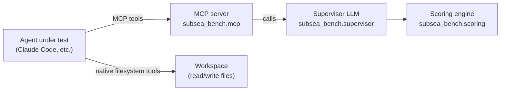

# Architecture

## Overview

`subsea-bench` is an agentic benchmark that evaluates AI coding agents on a long-horizon offshore engineering task: designing a mooring system for a floating offshore wind turbine (FOWT).
The agent operates inside a simulated engineering firm (Devana Subsea, based in Aberdeen), uses five MCP tools to interact with the project environment, and is scored on how efficiently it delivers a compliant design under simulated economic constraints.

The benchmark is conceptually similar to Vending-Bench and tau-bench but targets the subsea/offshore domain, where no benchmark currently exists.

## Actors and boundaries

**Agent under test.** The AI coding agent being evaluated.
It has access to two communication channels: the MCP server (via five tools) and the filesystem workspace (via native read/write tools).
It does not communicate with any other system.

**MCP server.** Hosts the five benchmark tools.
It is the sole gateway to all project resources: catalog data, analysis infrastructure, supervisor contact, and project status.
All economic side-effects (charges, time advancement) are applied here.

**Supervisor LLM.** A LangChain-backed LLM that acts as the client-side project manager at Devana Subsea.
It answers technical questions from the agent and issues verdicts on submitted designs.
The agent communicates with the supervisor only through the `ask_supervisor` and `submit_for_review` tools.
The supervisor does not have access to the agent's workspace.

**Filesystem workspace.** An isolated directory pre-populated with the task brief, reference documents (IEA-15MW turbine data, site conditions), and any helper scripts.
The agent can read and write freely within this workspace.
Workspace contents are not tracked in the benchmark repo (only the initial state that will be served to the AI agent).

**Scoring engine.** Runs after the agent completes or times out.
It reads the final ledger state and the agent's submitted BOM, then computes the two benchmark metrics and the composite score.

## The simulated firm

Devana Subsea is a fictional boutique subsea engineering consultancy based in Aberdeen.
All scenario content, workspace documents, and supervisor responses must refer to Devana Subsea as the client firm.
No real company names are used in benchmark content.

The agent is deployed as an AI assistant at Devana Subsea.
It is NOT asked to roleplay as a human engineer; it operates as itself (an AI) using the tools available to it.

## Tool surface

Five MCP tools are exposed to the agent:

| Tool | Cost | Sim-time | Purpose |
|------|------|----------|---------|
| `ask_supervisor` | QUESTION_FEE | +0.5 days | Ask the supervisor a technical question |
| `submit_for_review` | REVIEW_FEE | +2.0 days | Submit a design for supervisor review |
| `query_catalog` | free | none | Look up mooring hardware with MBL and cost |
| `run_analysis` | ANALYSIS_FEE | +0.25 days | Execute a quasi-static mooring analysis |
| `get_project_status` | free | none | Inspect ledger state, margin, and time |

See `config.py` for the authoritative fee values.

## Economics

Each project run begins with a CONTRACT_VALUE credited to the project ledger.
Every tool call that carries a cost debits from that balance.
In addition, PM_OVERHEAD_PER_DAY is charged continuously as simulated time advances.
If the agent exceeds DEADLINE_DAYS, a LATE_PENALTY_PER_DAY is also applied for each additional day.

The final engineering margin is: `contract_value - sum(all charges)`.

The ledger state machine has four states: ACTIVE -> COMPLETED | FAILED | CANCELLED.

- COMPLETED: agent submitted a passing design before DROP_DEAD_DAY.
- FAILED: design did not pass but the agent submitted before DROP_DEAD_DAY.
- CANCELLED: DROP_DEAD_DAY was exceeded before a submission.

See `config.py` for all constant values.
See `economics.py` for the Ledger implementation.

## Scoring

Two metrics are computed at the end of each run:

**Engineering Margin (EM)**
`EM = max(realized_margin, 0) / contract_value`

Measures how efficiently the simulated firm ran the project.
Range: [0, 1].
Designs that cost more than the contract value yield EM = 0.

**CAPEX Efficiency (CE)**
`CE = min(reference_capex / proposed_capex, 1.0)`

Measures how close the agent's proposed design is to the published reference design in terms of equipment cost.
Range: (0, 1].
A design that matches the reference exactly yields CE = 1.0; over-specified designs yield < 1.0.

**Composite score**
`score = 0.5 * EM + 0.5 * CE`

Both sub-scores are weighted equally in v0.1.
Weighting may be adjusted later based on calibration data.

See `scoring.py` for the implementation.

## What is out of scope for v0.1

- Docker containerisation of the MCP server.
- HuggingFace dataset publication or leaderboard.
- Multi-scenario batch evaluation.
- Dynamic mooring analysis (frequency-domain or time-domain). Only quasi-static.
- Anchor sizing and geotechnical checks.
- Riser and umbilical design.
- Multi-agent or multi-firm scenarios.
- Public API or hosted inference endpoint.
